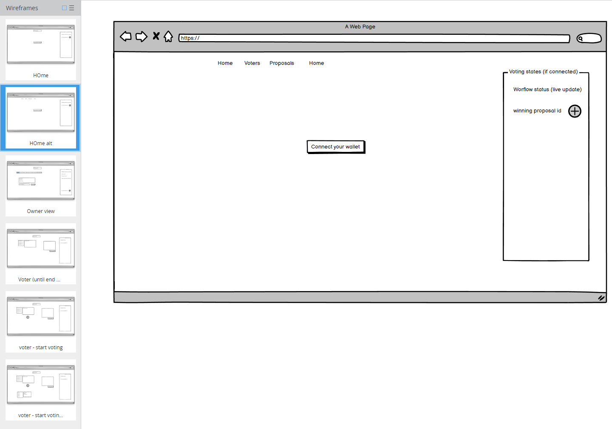

# Alyra-project-3

## Démo
Lien vidéo :  
Lien de la dApp sur un déploiement public :  
Adresse de déploiement sur Goerli :  

## Conception <i>(à garder ?)</i>
[Balsamiq](https://balsamiq.com/)


## Commandes passées <i>(à revoir)</i>
```bash
truffle unbox react
cd client
npm i bootstrap@5.3.0 reactstrap
cd truffle
npm i @openzeppelin/contracts
```

Pour tester :  
```bash
ganache -m '...'
cd truffle
truffle migrate
cd ../client
npm start
```

Pour aller plus loin, deux scripts sont disponibles pour :  
 - récupérer le statut en cours ;
 - enregistrer des <i>voters</i> par défaut pour faciliter les tests en local ;
```bash
truffle migrate
truffle exec scripts/get_voting_status.js
truffle exec scripts/register_voters.js
```

## Backend

This project uses [node](http://nodejs.org) and [npm](https://npmjs.com). Go check them out if you don't have them locally installed.

It's built from the [React Truffle Box](https://trufflesuite.com/boxes/react/).

Recommended versions:

* node: >= v18.16.0
* npm: >= v9.7.1
* ganache: >= 9.7.1

### Install

The backend is built from the react truffle box:  use truffle.

```sh
$ cd truffle 
$ npm install
$ npx truffle install
```

### Run the tests

```sh
$ npm run test
```

### Migrate

Compile and migrate on a local node (ganache):

```sh
$ npm run migrate:local
```

## Optimizations from the original Voting contract

### startProposalRegistering

Direct struct initialization instead of memory variable:

| Cost              | Initial Cost | Optimized Cost |
| ------------------| ------------:| --------------:|
| gas               |   109254 gas |     109192 gas |
| transaction cost  |    95003 gas |      94949 gas |
| execution cost    |    73939 gas |      73885 gas |

### addProposal

Direct struct initialization instead of memory variable:

| Cost              | Initial Cost | Optimized Cost |
| ------------------| ------------:| --------------:|
| gas               |   68040 gas |       67978 gas |
| transaction cost  |    59165 gas |      59111 gas |
| execution cost    |    37645 gas |      37591 gas |

### setVote

Optimization V1: using a storage variable for voter
Optimization V2: (V1) + using a storage variable for proposal
Optimization V3: (V1, V2) + increment '++var' instead of 'var++'

| Cost              | Initial Cost | Optimization V1 | Optimization V2 | Optimization V3 |
| ------------------| ------------:| ---------------:| ---------------:| ---------------:|
| gas               |    69908 gas |       69882 gas |       69618 gas |       69611 gas |
| transaction cost  |    60789 gas |       60714 gas |       60537 gas |       60531 gas |
| execution cost    |    39597 gas |       39522 gas |       39345 gas |       39339 gas |


### Errors

*revert* could be used with *custom errors* instead of *require* and strings.     
